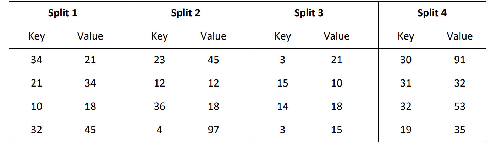
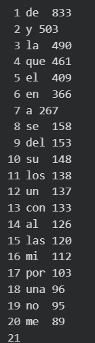
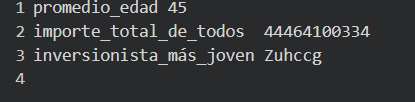

# Práctica 1

## 1) Dado el siguiente dataset:


Responda para cada job: ¿Cuántas veces (invocaciones) se ejecuta la función map?
¿Cuántas veces (invocaciones) se ejecuta la función reduce? ¿Cuántos mappers se
ejecutan? ¿Cuántos reducers se ejecutan? ¿Qué datos recibe cada función reduce?
¿Cuál es la salida de cada job?
### a) Job A:

```python 

    def map(k1, v1, context):
        context.write(1, v1)
 
    def reduce(k2, v2, context):
        n = 0
        for v in v2:
            n = n + 1
        context.write(k2, n)
```

La función map se invoca 16 veces, 1 por cada registro de cada split. La función reduce se ejecuta 1 vez, dado que la función map le pone la clave "1" a cada valor. Se ejecutan 4 mappers, uno por split. Se ejecuta un único reduce. La función reduce recibe una tupla con la clave "1" y una lista de valores asociados a la clave, es decir, todos los valores de las columnas "value" de cada split. La salida del job es una tupla con la clave "1" y la cantidad de valores contados (16).

### b) Job B:

```python

    def map(k1, v1, context):
        context.write(1, v1)
    def reduce(k2, v2, context):
        n = 0
        for v in v2:
            n = n + v
        context.write(k2, n)
```

La función map se invoca 16 veces, 1 por cada registro de cada split. La función reduce se ejecuta 1 vez, dado que la función map le pone la clave "1" a cada valor. Se ejecutan 4 mappers, uno por split. Se ejecuta un único reduce. La función reduce recibe una tupla con la clave "1" y una lista de valores asociados a la clave, es decir, todos los valores de las columnas "value" de cada split. La salida del job es una tupla con la clave "1" y la suma de todos los valores de la lista.

### c) Job C:

```python

    def map(k1, v1, context):
        if (v1 < 30):
            context.write(1, k1)
        else:
            context.write(2, k1)

    def reduce(k2, v2, context):    
        max = -1
        for v in v2:
        if(v > max):
            max = v
        context.write(k2, max)
```

La función map se invoca 16 veces, 1 por cada registro de cada split. La función reduce se ejecuta 2 veces, ya que hay 2 claves distintas ("1" y "2"). Se ejecutan 4 mappers, uno por split. Se ejecutan 2 reduces, uno por invocación. La función reduce recibe una tupla con una clave (que puede ser "1" o "2") y la lista de valores asociados a la clave (si la clave es "1", se reciben aquellos valores menores a 30; si no, se reciben los demás valores). La salida del job es una tupla con la clave correspondiente y el valor máximo asociado a cada clave (21 en el caso de "1" y 97 en el caso de "2").

### d) Job D:

```python

    def map(k1, v1, context):
        for v in range(v1):
            context.write(k1, v1)

    def reduce(k2, v2, context):
        n = 0
        for v in v2:
            n = n + 1
        context.write(k2, n)
```

La función map se invoca 16 veces, 1 por cada registro de cada split. La función reduce se ejecuta 16 veces, una por cada clave, ya que el map escribe la clave que recibe. Se ejecutan 4 mappers, uno por split. Se ejecutan 16 reduces, uno por clave. La función reduce recibe una tupla con una clave y una lista que contiene el rango de valores desde el 0 hasta el valor asociado a esa clave menos 1. La salida del job es una tupla que contiene la clave recibida por reduce y la cantidad de valores del rango asociado a esa clave.

### e) Job E:

```python

    def map(k1, v1, context):
        context.write(v1, k1)

    def reduce(k2, v2, context):
        n = 0
        for v in v2:    
            n = n + 1
            context.write(v, n)
```

La función map se invoca 16 veces, 1 por cada registro de cada split. La función reduce se ejecuta 12 veces, esto es debido a que la función map escribe en el context el valor recibido como clave y la clave recibida como valor, y como hay 4 repeticiones de valores, entonces el número de ejecuciones de reduce es 12. Se ejecutan 4 mappers. Se ejcutan 12 reducers. La función reduce recibe una tupla con una clave k2 (que era el valor v1 recibido por map) y la lista de valores asociados (que eran claves recibidas en k1 en la función map). La salida del job son tuplas que contienen cada una un número de la lista obtenida en reduce junto con un número que va aumentando desde el 1.


## 2) El dataset Libros provisto por la cátedra almacena libros cada uno en un archivo separado. Dentro de cada archivo, la primera línea tiene el título del libro y luego en las líneas siguientes un párrafo por línea. Ejecute el proyecto WordCount dado por la cátedra para saber cuántas veces es utilizada cada palabra.

Ejercicio hecho en google colab.

## 3) En el ejercicio anterior ¿Cómo haría para obtener el top 20 de las palabras más usadas?

En el emulador, se debe modificar la función finish para ordenar de forma descendente según el número de ocurrencias y luego obtener los primeros 20 lugares:

```python
    def finish(this):
        this.createOrCleanDir(this.__output)
        this.__result.sort(key=lambda r: (r[1],r[0]), reverse=True)
        this.__result = this.__result[:20]
        f = open(this.__output + "/output.txt", "w+")
        for t in this.__result:
            f.write(this.__flat(t[0]) 
                + OutputKeyValueSeparator 
                + this.__flat(t[1]) + "\n")
        f.close()
```

Salida:



## 4) Modifique el proyecto WordCount para contar cuántas vocales, consonantes, dígitos, espacios y otros caracteres posee el data set Libros.

Nuevo WordCount:

```python
    root_path = "/content/"

    inputDir = root_path + "WordCount/input/"
    outputDir = root_path + "WordCount/output/"
    CONJ_VOCALES = "aeiouáéíóúAEIOUÁÉÍÓÚ"
    def fmap(key, value, context):
        for caracter in value:
            if caracter.isspace():
                context.write("espacio", 1)
            elif caracter.isdigit():
                context.write("digito", 1)
            elif caracter.isalpha():  # Verifica si es una letra
                if caracter in CONJ_VOCALES:
                    context.write("vocal", 1)
                else:
                    context.write("consonante", 1)
            else:
                context.write("otro caracter", 1)
    
    def fred(key, values, context):
        c=0
        for v in values:
            c=c+1
        context.write(key, c)

    job = Job(inputDir, outputDir, fmap, fred)
    success = job.waitForCompletion()
```
 
## 5) Indique si utilizando el dataset Libros es posible resolver los siguientes problemas: 
## a. Obtener los títulos de todos los libros
Sí, pero se debe modificar el emulador para que al leer las lineas de los archivos con readlines(), se guarde además el nombre del mismo. Pero esto implicaría propagar este cambio a otras partes del código para que la función map reciba el nombre del archivo además de la clave y un valor.
## b. Obtener la cantidad de palabras promedio por párrafo
Sí, pero se debe modificar el emulador.
## c. Obtener la cantidad de párrafos promedio por libro
Sí, pero se debe modificar el emulador.
## d. Obtener la cantidad de caracteres del párrafo más extenso
Sí, pero se debe modificar el emulador.
## e. Cantidad total de párrafos con diálogos (se entiende por párrafo con diálogo aquel que empieza con un guión)
Sí, pero se debe modificar el emulador.
## f. El diálogo más largo (se entiende por diálogo a una secuencia de párrafos con diálogo que aparecen de manera consecutiva)
Sí, modificando el emulador.
## g. El top 20 de las palabras más usadas por cada libro 
Sí, modificando el diálogo.

## 6) Una empresa proveedora de internet realizó una encuesta para conocer el grado de satisfacción de sus clientes, en un formulario web los clientes debían completar un campo con los textos "Muy satisfecho", "Algo satisfecho", "Poco satisfecho", “Disconforme” o "Muy disconforme". Utilice el dataset Encuesta para saber cuántos clientes están en cada una de las cinco categorías.

Ejercicio hecho en google colab.

## 7) El dataset Inversionistas posee los nombres, dni, fecha de nacimiento (día, mes y año como campos separados) e importe invertido por diferentes personas en la apertura de un nuevo negocio en la ciudad. Se desea saber:
### a. El nombre del inversionista más joven
### b. El total del importe invertido por todos los inversionistas
### c. El promedio de edad
## Implemente una solución en MapReduce. ¿Se puede resolver los tres problemas en unúnico job?

Se puede implementar en un único job:

```python
    import datetime

    root_path = "/content/"

    inputDir = root_path + "WordCount/input/"
    outputDir = root_path + "WordCount/output/"

    def calcular_edad(dia, mes, anio):
        fecha_actual = datetime.date.today()
        nacimiento = datetime.date(anio, mes, dia)
        edad = fecha_actual.year - nacimiento.year
        if (fecha_actual.month, fecha_actual.day) < (nacimiento.month, nacimiento.day):
            edad -= 1
        return edad

    def fmap(key, value, context):
        inv = value.split()
        nombre, dia, mes, anio, importe = inv
        fecha_nac = (int(anio), int(mes), int(dia))

        #punto a)
        context.write("más_joven", (fecha_nac, nombre))
        #punto b)
        context.write("importe_total", int(importe))
        #punto c)
        context.write("edades", calcular_edad(int(dia), int(mes), int(anio)))

    def fred(key, values, context):
        if key == "más_joven":
            _, nombre = max(values, key=lambda t: t[0])
            context.write("inversionista_más_joven", nombre)
        elif: key == "importe_total"
            importe_total = sum(values)
            context.write("importe_total_de_todos", importe_total)
        else:
            edades = list(values)
            prom = sum(edades) / len(edades)
            context.write("promedio_edad", int(prom))


    job = Job(inputDir, outputDir, fmap, fred)
    success = job.waitForCompletion()
```

Salida:




## 8) Si contáramos con un cluster donde podemos configurar 100 nodos para la tarea de reduce ¿De qué manera se podrían usar esos 100 nodos en el ejemplo de los eventos POSITIVO, NEGATIVO y NEUTRO visto en la teoría?